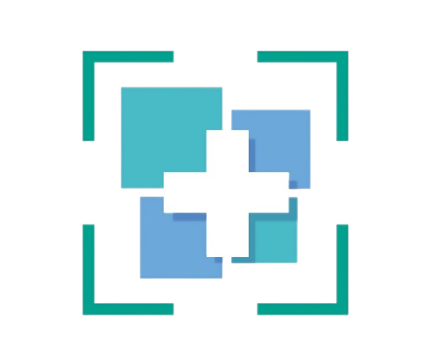
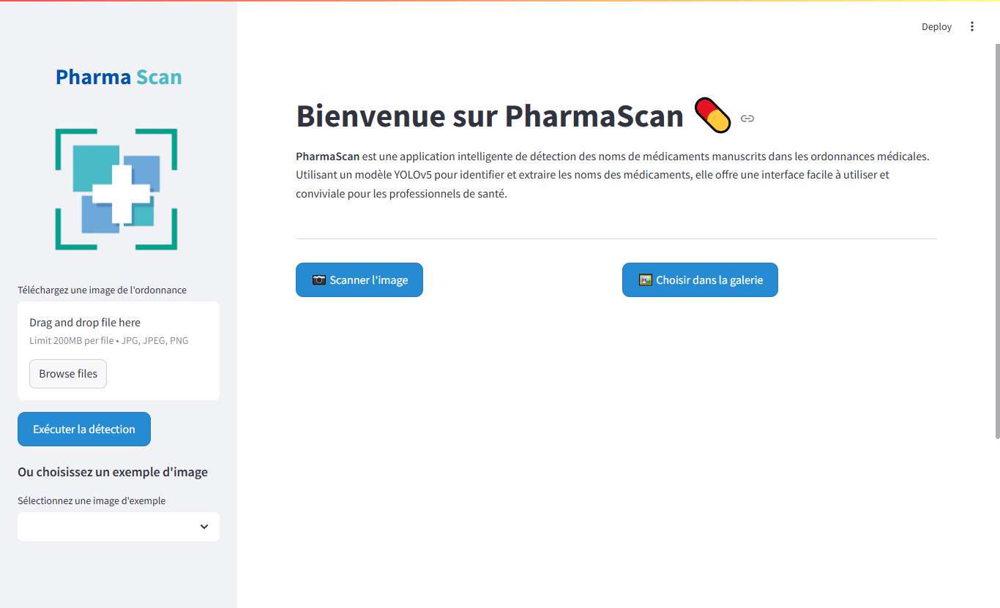
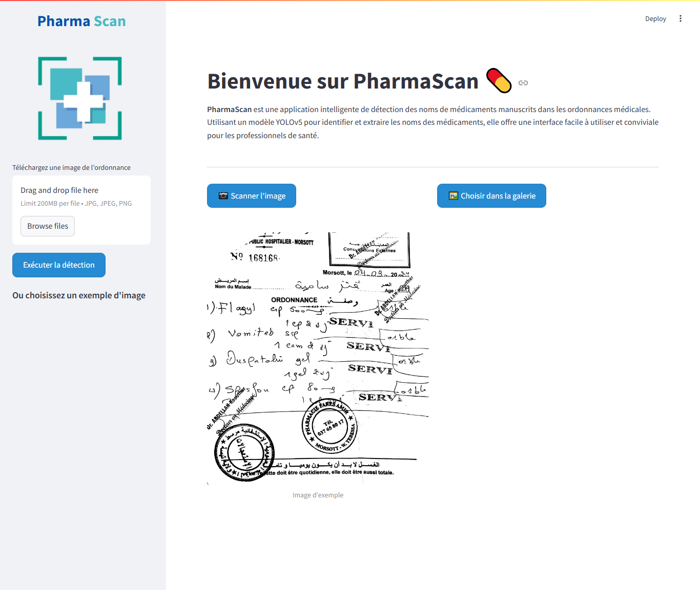
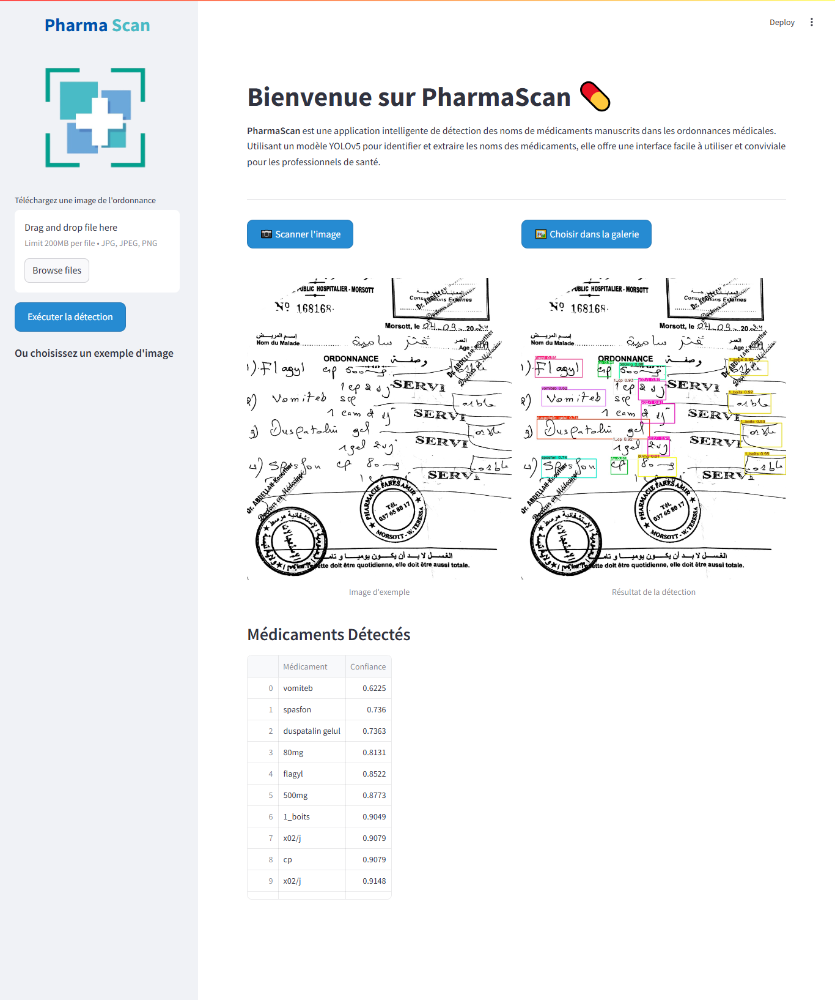
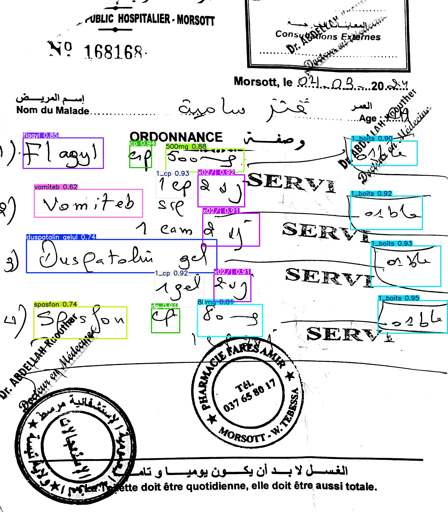

<div align="center">
  
</div>

# PharmaScan

**PharmaScan** is a Streamlit-based web application that uses a custom YOLOv5 model to detect and extract handwritten medication names and their details from scanned medical prescriptions. It provides a simple, user-friendly interface to upload prescription images, analyze them with AI, and display the detected medications along with their confidence scores.

---

## Table of Contents

- [Features](#features)
- [Screenshots](#screenshots)
- [How It Works](#how-it-works)
- [Installation and Usage](#installation-and-usage)
- [Model and Dataset](#model-and-dataset)
- [Project Structure](#project-structure)
- [Contact](#contact)
- [License](#license)

---

## Features

1. **Image Upload**  
   Users can upload prescription images directly from their local system.

2. **Real-Time Detection**  
   A custom YOLOv5 model processes the uploaded image, detecting:
   - **Drug Names**  
   - **Quantities**  
   - **Dosage Information**  

3. **Interactive Interface**  
   - View the original image and the detection results side-by-side.
   - A table listing detected medications, confidence scores, and other relevant info.

4. **Streamlit Integration**  
   - Easy to run locally or deploy on popular cloud platforms (Streamlit Sharing, Heroku, etc.).
   - Responsive web UI.

---

## Screenshots

Below are the main views of **PharmaScan**, displayed one by one with brief descriptions:

### PharmaScan Home

*The main landing page showing the title, introduction, and buttons for scanning or choosing an image.*

### Sample Prescription

*A prescription image before detection, demonstrating how text appears in the original scan.*

### Result Overview

*Side-by-side comparison of the original prescription and the detected bounding boxes, along with the list of detected medications.*

### Detection Result

*The final processed image showcasing bounding boxes around identified drug names and other relevant information.*

---

## How It Works

1. **Upload**: The user selects or drags and drops a prescription image onto the web app.
2. **Processing**: The YOLOv5 model runs object detection on the image to locate and label handwritten medication details.
3. **Display**: PharmaScan displays the original image alongside the detection output. A table below shows each detected medication and confidence score.

---

## Installation and Usage

1. **Clone the Repository**
   ```bash
   git clone https://github.com/mohamed-ladjal-AI/PharmaScan.git
   cd PharmaScan
   ```

2. **Create and Activate a Virtual Environment (Optional but Recommended)**
   ```bash
   # For example, using conda:
   conda create -n pharmascan python=3.9
   conda activate pharmascan
   ```

3. **Install Dependencies**
   ```bash
   pip install -r requirements.txt
   ```

4. **Run the Streamlit App**
   ```bash
   streamlit run web-app.py
   ```
   The app will open in your default browser at `http://localhost:8501` (or another port if 8501 is in use).

---

## Model and Dataset

- **Model**: This project uses a custom YOLOv5 model fine-tuned for prescription medication name detection.
- **Dataset**: The dataset used to train the YOLOv5 model is **private** and cannot be published publicly.  
  If you urgently need access to the dataset for research or collaboration, please [contact me](#contact).

---

## Project Structure

```
PharmaScan/
├── assets/
│   ├── screencapture1.png
│   ├── screencapture2.png
│   ├── screencapture3.png
│   ├── result.jpg
│   └── logo.png
├── yolov5/
│   └── ... (YOLOv5 code and files)
├── web-app.py
├── requirements.txt
├── README.md
└── ...
```

- **`web-app.py`**: Main Streamlit application file.
- **`yolov5/`**: YOLOv5 code and scripts for detection.
- **`assets/`**: Contains images for the README and the application logo.

---

## Contact

- **Author**: Mohamed Ladjal  
- **Email**: [mohamed.laadjel2019@gmail.com](mailto:mohamed.laadjel2019@gmail.com)

Feel free to reach out if you have questions about the model, the dataset, or potential collaboration opportunities.

---

## License

This project is licensed under the [MIT License](LICENSE).  
You’re free to use, modify, and distribute the code as long as the original license is included.
